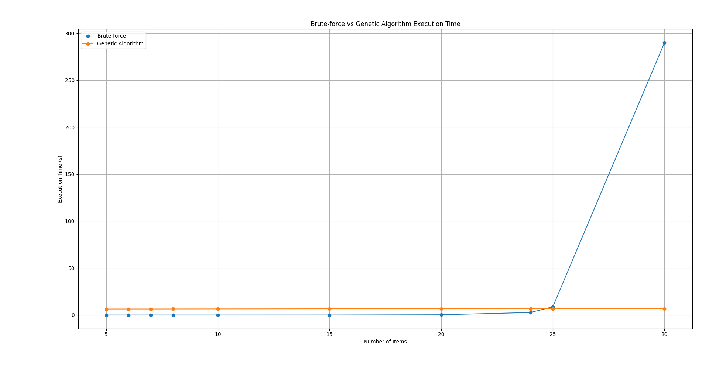

# Knapsack Problem
- The knapsack problem is a combinatorial optimization problem where you need to select a set of items, each with a weight and a value, to maximize the total value without exceeding a given weight limit.

## Context
- Given a list items with their corresponding weights and values, our algorithm will try to choose the most valuable combination that fits within the capacity constraint.
- E.g: `items = [1, 1, 3] , weights = [1, 2 , 3],  capacity = 3`
	$\rightarrow$ the optimal solution will be taking the item with weight 3, because taking items with weight 1 and 2 only achieves the total value of 2 which is less than 3.

## Framework
- This section uses Python for better readability and demonstration.

## The Brute-force Approach
- With this approach, we will go through every possible combinations.
```python
def bruteforce(
    capacity: int, items: List[int], weights: List[int], solution: List[int]
):
    def dfs(W, idx):
        if idx == len(items) or W == 0:
            return 0, [0] * len(items)

        if weights[idx] > W:
            return dfs(W, idx + 1)

        profit_pick, comb_pick = dfs(W - weights[idx], idx + 1)
        profit_pick += items[idx]
        comb_pick[idx] = 1

        profit_not_pick, comb_not_pick = dfs(W, idx + 1)

        if profit_pick > profit_not_pick:
            return profit_pick, comb_pick
        else:
            return profit_not_pick, comb_not_pick

    best_profit, best_combination = dfs(capacity, 0)

    print(
        f"Recursive Answer: {best_combination}, relativity to true answer: {relativityToSolution(best_combination, items, solution)}%"
    )
```
- This method always leads to the optimal solution, as it exhaustively evaluates all combinations.

- Time complexity: $O(2^n)$, where n is the number of items.

## Genetic Algorithms
- We will first configure the evolution process:
	- The **maximum number of individuals in a generation** will be 500.
	- The number of **elite individuals** will be 50.
	- Chance for mutation is 20%.
	- And the process will have to go through 20 generations.
```python
def geneticAlgorithms(
    capacity: int, items: List[int], weights: List[int], solution: List[int]
):
    Population = initialize(len(items))

    for gen in range(NUM_OF_GENERATIONS):
        next_generation = list()
        mated = set()

        Population.sort(
            key=lambda x: calculate_fitness(x, capacity, items, weights), reverse=True
        )

        for elite in range(ELITE_INDIVIDUALS):
            next_generation.append(Population[elite])

        for p1 in range(len(Population)):
            if p1 in mated:
                continue
            for p2 in range(len(Population)):
                if p1 == p2 or p2 in mated:
                    continue
                num_of_kids = np.random.randint(1, 4)
                while num_of_kids and len(next_generation) <= MAX_POPULATION:
                    kid = mate(Population[p1], Population[p2])
                    next_generation.append(kid)
                    num_of_kids -= 1

        Population = next_generation.copy()

    Population = sorted(
        Population,
        key=lambda x: calculate_fitness(x, capacity, items, weights),
        reverse=True,
    )
    print(
        f"Evolution Answer: {Population[0]}, relativity to true answer: {relativityToSolution(Population[0], items, solution)}%"
    )
```
- Unlike the brute-force method, the genetic algorithm does not guarantee a perfect solution but often achieves near-optimal results (typically >99% accuracy).

- Time complexity: $O(\text{{generations}} \times \text{{population size}} \times n)$ $\rightarrow$ This is a major improvement, especially for large n, compared to the exponential complexity of brute-force.
## Results

```
...
<< PROBLEM 7 >>
Recursive Answer: [1, 0, 1, 0, 1, 0, 1, 1, 1, 0, 0, 0, 0, 1, 1], relativity to true answer: 100.0%
Evolution Answer: [1, 0, 1, 0, 1, 0, 1, 1, 1, 0, 0, 0, 0, 1, 1], relativity to true answer: 100.0%
<< PROBLEM 8 >>
Recursive Answer: [1, 1, 0, 1, 1, 1, 0, 0, 0, 1, 1, 0, 1, 0, 0, 1, 0, 0, 0, 0, 0, 1, 1, 1], relativity to true answer: 100.0%
Evolution Answer: [1, 1, 0, 1, 0, 1, 1, 0, 1, 1, 1, 0, 1, 0, 0, 1, 0, 0, 0, 0, 0, 1, 0, 0], relativity to true answer: 99.77761612695284%
<< PROBLEM 9 >>
Recursive Answer: [1, 1, 1, 1, 1, 0, 0, 1, 0, 1], relativity to true answer: 100.0%
Evolution Answer: [1, 1, 1, 1, 1, 0, 0, 1, 0, 1], relativity to true answer: 100.0%
<< PROBLEM 10 >>
Recursive Answer: [1, 0, 1, 0, 1, 1, 1, 0, 1, 1, 1, 1, 0, 1, 1], relativity to true answer: 100.0%
Evolution Answer: [1, 0, 1, 0, 1, 1, 1, 0, 1, 1, 1, 1, 0, 1, 1], relativity to true answer: 100.0%
<< PROBLEM 11 >>
Recursive Answer: [1, 0, 0, 1, 0, 1, 0, 1, 1, 0, 1, 1, 1, 0, 1, 1, 1, 0, 1, 1], relativity to true answer: 100.0%
Evolution Answer: [1, 0, 0, 1, 0, 1, 0, 1, 1, 0, 1, 1, 1, 0, 1, 1, 1, 0, 1, 1], relativity to true answer: 100.0%
<< PROBLEM 12 >>
Recursive Answer: [0, 1, 1, 1, 1, 1, 1, 1, 0, 1, 1, 1, 1, 1, 1, 1, 0, 1, 0, 1, 0, 1, 0, 1, 0], relativity to true answer: 100.0%
Evolution Answer: [0, 1, 1, 1, 1, 1, 1, 1, 0, 1, 1, 1, 1, 1, 1, 1, 0, 1, 0, 1, 0, 1, 0, 1, 0], relativity to true answer: 100.0%
<< PROBLEM 13 >>
Recursive Answer: [1, 0, 1, 0, 0, 0, 1, 1, 1, 1, 1, 1, 0, 1, 1, 1, 0, 1, 0, 1, 0, 1, 1, 1, 1, 1, 1, 1, 0, 1], relativity to true answer: 100.0%
Evolution Answer: [1, 0, 1, 1, 0, 0, 1, 1, 1, 1, 1, 1, 0, 1, 1, 0, 0, 1, 0, 1, 0, 1, 1, 0, 1, 1, 1, 1, 0, 1], relativity to true answer: 99.80430528375733%
```
- As we can see, the answer of each approach has almost the same value, whereas the brute-force approach always gives us the perfect solution in constrast of GAs.
- But what will surprise us is the time it tooked for each ways:


- In the beginning, brute-force seems to be the ways for this problem, but the cut-off starts at 25 items, where time just seems to grow exponentially. On the other hand, GAs seem like a constant time even.
- Even at 30 items, where brute-force took astonishingly 5 whole minutes to finish, whereas GA runtime still remains at almost constant of ~6s.

## Conclusion
- The brute-force approach guarantees a perfect solution by exhaustively searching all possibilities, but its exponential time complexity makes it impractical for large problem sizes.

- Genetic algorithms (GAs), while not always optimal, consistently produce near-optimal solutions with significantly lower computation time, especially as the number of items increases.

- Experimental results confirm that GAs offer a highly efficient and acceptable result with minimal loss.