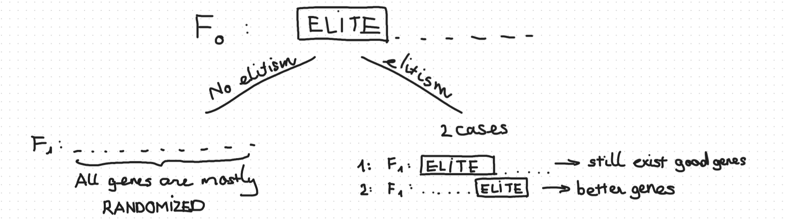

# Brief Introduction
- **GAs** draw inspiration from the process of natural selection—a mechanism Charles Darwin popularized after observing species variation during his 1835 voyage on the HMS Beagle. For example, the Galápagos penguin (Spheniscus mendiculus), the only penguin species living north of the equator, has evolved compact bodies and specialized salt‑removal glands to thrive in the tropical archipelago’s mix of semi‑arid and savanna climates. This example mirrors how GAs iteratively refine candidate solutions through selection, crossover, and mutation to optimize performance over successive generations.
- **GAs** simulate the process of natural selection which means those species that can adapt to changes in their environment can survive and reproduce and go to the next generation. In simple words, they simulate "survival of the fittest" among individuals of generations to solve a problem.

# Main Motivation
1. Individuals of a generation compete for a selected task.
2. Successful individuals then mate to produce offspring.
3. Genetic traits are passed on, and weaker traits are gradually replaced by stronger ones in later generations.
4. Over successive generations, the population’s performance on the task improves.

## Fitness score
- Fitness score is used to calculate the ability of a individual.
- The higher their fitness score, the higher their chance of selection for reproduction
- Later generations *should typically* improve the fitness score.

## Operators
- Selection: give preference to individuals with good fitness scores and allow them to pass their genes onto the successive generation.
- Crossover: representing the process of mating between two selcted individuals through the selection operator. 
- Mutation: main idea is to insert random genes in offspring to maintain the diversity of the population.

## Summarized process
1. Initialize populations
2. Calculate the fitness of the population.
3. "Evolution process":
	a. Select successful parents.
	b. Mating process.
	c. Mutation process.
	d. Goto 2 until convergence (when the task is solved or after a number of generations).

# Implementation

## Introduction Task (Guessing Sentence)

### Notes
- For convenience, I will write this task in C++, because of direct string modification is not supported in Python.
- For this task, I will redefine **fitness score** as **loss** (due to reversed sorting), which is calculated by the number of differences between the "target" and the "gene".

### Initialization
- A **generation** will have the **maximum** of 1000 **Individuals**.
```cpp
#define MAX_POPULATION 1000
```
- We then initialize the first generation with `MAX_POPULATION` individuals with their genes having been randomly initialized.
- Our target sentence will be `This is a secret message.`
```cpp
const std::string task = "This is a secret message.";
```

```cpp
std::vector<Individual> population;

for (int i = 0; i < MAX_POPULATION; i++)
	population.push_back(Individual(length_of_genes));
```
- The mutation chance will be 10%.
### Individual Class
- Attributes:
	- Genes: self-explanatory.
	- Loss score: the lower the loss score, the better the genes.
- Main methods:
	- Mate: simulate the mating and genes creation process.
	- Calculate loss.
 
### Elitism Process
- We will carry a portion of survivor from the previous generation to the successor *(will be explained later why)*.
```cpp
#define ELITE_INDIVIDUALS 3
```

### Natural Selection & Reproduction
```cpp
void natural_selection(std::vector<Individual> &population)
{
    for (Individual &inv : population)
	inv.calculate_loss(task);
}
```
- We will first pick the top individuals from the previous generation for the reproduction process after loss calculation.
- Each parents can have a random number of children (1 to 3) to ensure there will be no extinction happening.
- Repeat until the best genes match with the target `task`.

```cpp
while (population[0].genes_ != task)
{
	std::unordered_set<int> mated;
	std::vector<Individual> successors;
	
	std::sort(population.begin(), population.end());
		
	for (int i = 0; i < ELITE_INDIVIDUALS; i++)
	{
	    successors.push_back(population[i]);
	}
	
	for (int p1 = 0; p1 < (int)population.size() && successors.size() < MAX_POPULATION; ++p1)
	{
	    if (mated.count(p1))
		continue;
	    for (int p2 = p1 + 1; p2 < (int)population.size() && successors.size() < MAX_POPULATION; ++p2)
	    {
		if (mated.count(p2))
		    continue;
	
		int num_of_children = random_int(1, 3);
		while (num_of_children-- && successors.size() < MAX_POPULATION)
		{
		    Individual child = population[p1].mate(population[p2]);
		    successors.push_back(child);
		}
	
		mated.insert(p1);
		mated.insert(p2);
		break;
	    }
	
	    if (successors.size() >= MAX_POPULATION)
		break;
	}
	
	population.clear();
	population = successors;
	
	natural_selection(population);
}
```

### Why Elitism?
- Without elitism, it’s possible for all offspring to drift away from the current best solutions, causing the algorithm to get “stuck” in suboptimal loops. Elitism guarantees that the best genes always survive to the next generation, which accelerates convergence.



### Experiments
#### Mutation chance of 0%
- The genes of the successor never change $\rightarrow$ the evolution process stucks in a loop.
```
...
<< Generation: 24705 >>
Best genes: T≈ioÇis ` ⌐rnt m_ssaτ]ⁿ , loss: 12
<< Generation: 24706 >>
Best genes: T≈ioÇis ` ⌐rnt m_ssaτ]ⁿ , loss: 12
...
```
#### Mutation chance of 100%
- Pretty self explanatory, the genes of the parents never get passed to their child so convergence cannot be achieved (or can but with a ***super small*** chance) $\rightarrow$ the evolution process stucks in a loop.
```
...
<< Generation: 183 >>
Best genes: E╖WΓ █s╠ZR8åúúΣπ⌡1&-RÇUM , loss: 23
<< Generation: 184 >>
Best genes: ëÜMDj▄¡Ωa½ÇY╗rè⌠Nδ¢ö¢⌡E , loss: 23
<< Generation: 185 >>
Best genes: TÑ▀8X ú/ÆX%zì£/·;8jI , loss: 23
<< Generation: 186 >>
Best genes: û║9çiÑ=┌]╓Z½ªtù%zzú╓c╚╛ , loss: 23
...
```
#### With No Elitism
- As I have said above, there will be a chance where all of the successors' genes will be the same, and the process could never converge $\rightarrow$ the evolution process stucks in a loop.
```
...
<< Generation: 19445 >>
Best genes: 8│D═}≤~nnn ╞Wò-}╕ΓmÇ╙] , loss: 25
<< Generation: 19446 >>
Best genes: 8│D═}≤~nnn ╞Wò-}╕ΓmÇ╙] , loss: 25
<< Generation: 19447 >>
Best genes: 8│D═}≤~nnn ╞Wò-}╕ΓmÇ╙] , loss: 25
<< Generation: 19448 >>
Best genes: 8│D═}≤~nnn ╞Wò-}╕ΓmÇ╙] , loss: 25
...
```

#### With 5 Elite Individuals
- Because of the good genes getting passed, convergence can be achieved after a number of generations (~5000).
```
...
<< Generation: 4972 >>
Best genes: This is a s?cret message. , loss: 1
<< Generation: 4973 >>
Best genes: This is a s┘cret message. , loss: 1
<< Generation: 4974 >>
Best genes: This is a s?cret message. , loss: 1
<< Generation: 4975 >>
Best genes: This is a s┘cret message. , loss: 1
<< Generation: 4976 >>
Best genes: This is a s<cret message. , loss: 1
<< Generation: 4977 >>
Best genes: This is a secret message. , loss: 0
```

#### With 50 Elite Individuals
From this observation, we can assume that the more elite individuals the faster convergence is achieved.
```
...
<< Generation: 332 >>
Best genes: This is a sⁿcret message. , loss: 1
<< Generation: 333 >>
Best genes: This is a s╤cret message. , loss: 1
<< Generation: 334 >>
Best genes: This is a sⁿcret message. , loss: 1
<< Generation: 335 >>
Best genes: This is a s╤cret message. , loss: 1
<< Generation: 336 >>
Best genes: This is a secret message. , loss: 0
```

#### With 500 Elite Individuals
```
...
<< Generation: 83 >>
Best genes: This is a secret message , loss: 1
<< Generation: 84 >>
Best genes: This is a secret message¡ , loss: 1
<< Generation: 85 >>
Best genes: This is a secret message{ , loss: 1
<< Generation: 86 >>
Best genes: This is a secret messageö , loss: 1
<< Generation: 87 >>
Best genes: This is a secret message. , loss: 0
```

#### With 999 Elite Individuals
- But there will be a sweet spot for finding the correct genes, the more elite individuals, the more bad genes we will be including in the next generation, so be careful.
```
...
<< Generation: 29717 >>
Best genes: This js a secret message. , loss: 1
<< Generation: 29718 >>
Best genes: This js a secret message. , loss: 1
<< Generation: 29719 >>
Best genes: This js a secret message. , loss: 1
<< Generation: 29720 >>
Best genes: This s a secret message. , loss: 1
<< Generation: 29721 >>
Best genes: This is a secret message. , loss: 0
```

### Summarized Results

| Mutation Rate / Elites | Behavior                                                                      |
| ---------------------- | ----------------------------------------------------------------------------- |
| **0% mutation**        | No new diversity ⇒ stuck on initial genes                                     |
| **100% mutation**      | Parents never pass genes ⇒ near‑random search ⇒ rarely converges              |
| **No elitism**         | Good solutions can be lost ⇒ may loop without improvement                     |
| **5 elites**           | Converges in \~5 000 generations                                              |
| **50 elites**          | Converges in \~330 generations                                                |
| **500 elites**         | Converges in \~85 generations                                                 |
| **999 elites**         | Too many elites ⇒ slows improvement, though eventual convergence still occurs |

## NP-Hard Problems

- [Knapsack Problem](./NP-Hard/knapsack/knapsack.md).